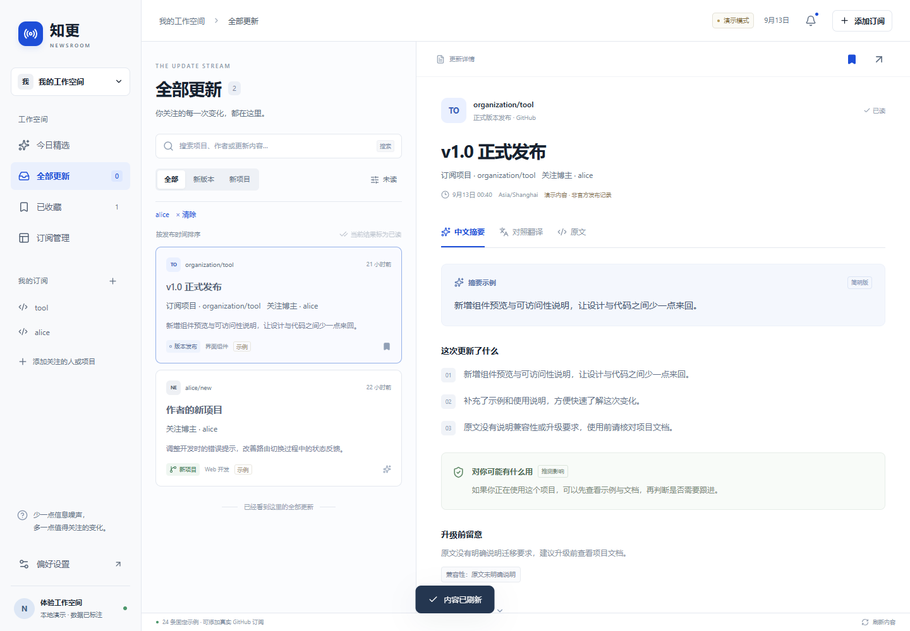
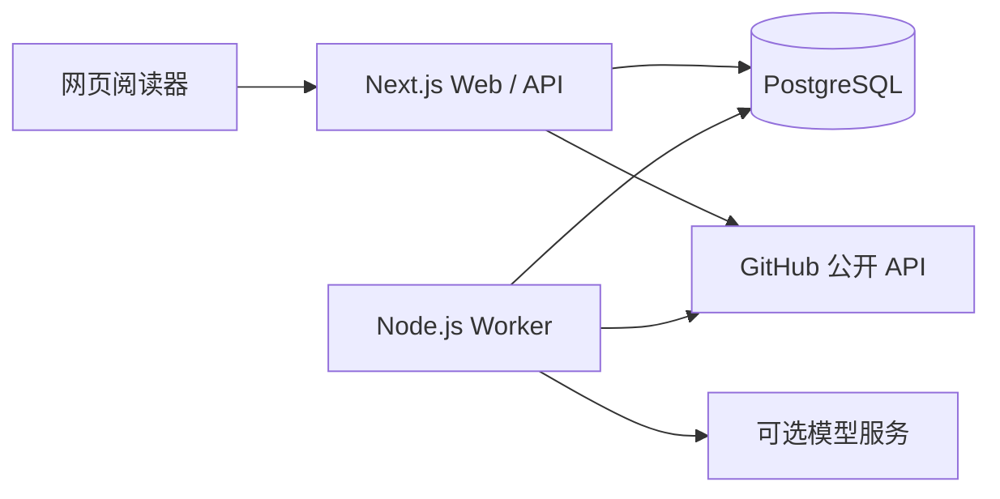

# 知更 / NEWSROOM

在一个网页里查看你关注的 GitHub 项目与开发者更新，阅读中文摘要、对照译文和原文，减少逐个打开仓库检查的时间。

**当前为可运行的本地 MVP，先做好 GitHub，再考虑其他平台。** 仅读取 GitHub 公开数据；网页内的订阅、已读和收藏只保存在本应用，不会替你 Star 或 Follow。没有邮件功能。



> 截图使用演示内容，展示双来源更新和阅读布局，不代表真实项目的发布记录。

## 已实现

| 功能 | 当前行为 |
| --- | --- |
| 项目订阅 | 跟踪正式 Release 和已收录版本说明的修改 |
| 博主订阅 | 跟踪其新建公开非 fork 仓库，以及本人发布的正式 Release，包含组织项目 |
| Star 导入 | 读取当前账号公开 Star，每 5 分钟发现新 Star 并加入本地订阅；取消 Star 不自动删除订阅 |
| 关注导入 | 勾选公开 following 中的开发者，当前预览前 50 人 |
| 项目搜索 | 在「添加订阅 → 搜索项目」搜索 GitHub 公开仓库，支持排序、分页和本地订阅 |
| Trending | 独立于个人 Star 的热门发现，支持常用编程语言榜单和按需中文简介 |
| 站内阅读 | 多来源去重、搜索与筛选、已读、收藏、上下对照翻译、桌面和手机布局 |
| AI 辅助 | 中文摘要、原文依据、按需翻译、缓存和用量预算，模型可关闭 |
| 授权与同步 | GitHub OAuth、账号允许名单、访问令牌自动续期、后台轮询和失败提示 |
| 站内简报 | 整理近期未读更新，网页内阅读，不发送邮件或推送 |

## 快速体验

准备 **Node.js 24+、pnpm 11、PostgreSQL 17**。推荐用 Docker Desktop 运行数据库，Web 和 Worker 在本机运行。

```powershell
git clone https://github.com/hjunhui0924-gif/news_updata.git
cd news_updata
pnpm install --frozen-lockfile
# 先启动 Docker Desktop
pnpm demo
```

打开 [http://127.0.0.1:3000](http://127.0.0.1:3000)。首次启动自动创建 `.env.local`、生成本地随机密钥、启动数据库、执行迁移并写入 24 条明确标识的演示内容，再启动 Web 和 Worker。**演示不需要 GitHub 登录或模型密钥，真实 AI 默认关闭。**

Ctrl+C 停止此次启动的应用进程，保留数据库。已有 `.env.local` 不会被覆盖；如果其中是 `APP_MODE=live`，请使用下方真实模式流程，不要用演示启动器。

已有 PostgreSQL 时，复制 `.env.example` 为 `.env.local`，设置自己的 `DATABASE_URL`、保持 `APP_MODE=demo`，执行 `pnpm demo --no-docker`。Docker Compose 只运行数据库，并非整套应用的容器镜像。

## 使用自己的 GitHub 账号

1. 复制 `.env.example` 为 `.env.local`，设 `APP_MODE=live`，填写数据库连接与随机 `BETTER_AUTH_SECRET`。
2. 在 GitHub 创建自己的 OAuth App，设置 Homepage URL 为 `http://127.0.0.1:3000`，回调为 `http://127.0.0.1:3000/api/auth/callback/github`。
3. 填写 `GITHUB_CLIENT_ID`、`GITHUB_CLIENT_SECRET` 和 `ALLOWED_GITHUB_USER_IDS`。允许名单使用 GitHub 的**稳定数字 ID**，不是用户名。
4. 启动数据库、迁移、Web 和 Worker：

```powershell
docker compose up -d --wait db # 使用现有 PostgreSQL 可跳过
pnpm db:migrate
pnpm dev
# 另开一个终端
pnpm worker:dev
```

通过网页跳转到 GitHub 官方页面登录。应用不接收 GitHub 密码；令牌服务端加密保存，按需自动续期。网页会话到期与 GitHub 授权失效是两回事。`GITHUB_READ_TOKEN` 是可选的服务端覆盖配置，普通个人使用可以留空。

仓库不包含作者的 `.env`、真实账号令牌、模型密钥或数据库，克隆后需要自己的配置。详见 [运行指南](docs/05-operations-and-quality.md)、[授权说明](docs/12-github-auth-renewal.md) 和 [安全边界](SECURITY.md)。

## AI 配置

默认可以阅读原文和体验演示译文。开启真实 AI 时，需要在 `.env.local` 设置兼容 Chat Completions 的模型地址、API Key、模型名和实际输入/输出单价，再设 `LLM_ENABLED=true`，重启 Web 与 Worker。

当前开发环境已联调 `qwen3.8-flash`；这不是仓库默认启用的付费服务。其他兼容模型需要验证结构化输出支持。摘要自动生成、全文翻译按需触发；原文会上送你配置的模型服务。预算为应用估算，不能替代供应商账户硬额度。见 [模型配置与费用](docs/05-operations-and-quality.md#模型配置)。

## 技术架构



Next.js 16 / React 19 / TypeScript 5.9、Tailwind 4、Radix Dialog、PostgreSQL 17、Drizzle + pg、pg-boss、Better Auth、Octokit、Vitest 和 Playwright。精确版本以 `package.json` 与 `pnpm-lock.yaml` 为准；不需要 Redis 或向量数据库。

```text
src/app/api/       Web 接口
src/components/    阅读、搜索、订阅和设置界面
src/server/        GitHub、授权、数据库、任务和 AI 服务
src/shared/        类型、筛选与对照翻译排版
src/worker/        后台调度与任务消费
scripts/          本地启动、迁移和演示种子
drizzle/          数据库迁移
tests/            单元、真实数据库集成和浏览器测试
docs/             产品、架构、运行与验证记录
```

## 开发与验证

```powershell
pnpm typecheck
pnpm lint
pnpm test                # 需要 PostgreSQL，使用独立 news_test 数据库
pnpm test:e2e:search     # 自动启动 3002 端口实例，覆盖最新搜索及其他增量流程
pnpm build              # Web + Worker 构建
```

浏览器测试优先使用 Windows 已安装的 Chrome；其他环境可先运行 `pnpm exec playwright install chromium`。测试与开发约定见 [贡献指南](CONTRIBUTING.md)。

2026-09-13 最新功能验证：**126 项单元/集成测试、10 项增量浏览器测试通过**，类型检查、Lint 和 Web/Worker 构建通过。真实 GitHub 登录、读取、令牌续期、项目搜索，以及 Qwen 摘要/翻译样本已联调。模拟浏览器测试不等同于真实模型端到端测试，不据此宣称内容准确率或长期稳定性。[完整验收记录](docs/07-mvp-validation.md)

## 当前边界与后续

- 仓库默认每 15 分钟、博主每 30 分钟检查；Star 发现每 5 分钟。需要数据库与 Worker 持续运行，不是实时推送。
- 博主版本事件最多覆盖 GitHub 最近 30 天、300 条公开活动；事件接口还可能延迟 30 秒至 6 小时，无法保证窗口外补查。
- 每用户最多 100 个项目、50 个博主；following 完整分页、后端信息流分页仍待实现。项目搜索最多浏览前 1000 个匹配。
- 全文翻译上限 16000 字符；Markdown 图片目前不展示。完整长文与图片阅读仍待完善。
- 暂不包含 X/Twitter、RSS、PR/Issue/提交动态、私有仓库、邮件、浏览器通知或公开注册。
- 没有完成公开部署、长期连续试用、备份恢复演练或正式安全审计。

下一步先完善博主导入、同步反馈和站内阅读，再进行至少 7 天真实试用，之后评估其他平台。[开发路线](docs/04-development-plan.md)

## 文档导航

- [产品需求](docs/01-product-requirements.md) · [技术架构](docs/02-architecture.md) · [界面规范](docs/03-ui-design.md)
- [开发路线](docs/04-development-plan.md) · [运行指南](docs/05-operations-and-quality.md) · [决策记录](docs/06-decisions.md)
- [验收记录](docs/07-mvp-validation.md) · [Star 跟踪](docs/08-starred-tracking.md) · [AI 联调](docs/09-ai-connection-status.md)
- [Trending 与对照翻译](docs/10-discovery-and-bilingual.md) · [博主与项目规则](docs/11-github-following-scope.md)
- [授权自动续期](docs/12-github-auth-renewal.md) · [公开项目搜索](docs/13-github-project-search.md)
- [变更记录](CHANGELOG.md) · [安全说明](SECURITY.md) · [开发贡献](CONTRIBUTING.md)
