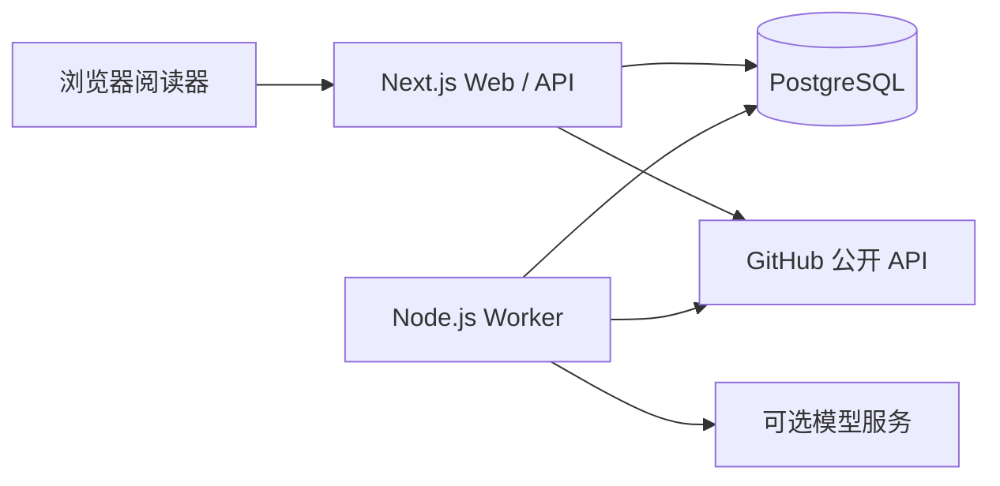

# 技术架构 · 当前实现

更新日期：2026-09-13。

## 运行组成

Web 和 Worker 是两个进程，共享 TypeScript 类型、数据库访问及服务配置。pg-boss 使用同一个 PostgreSQL 的独立 schema，不引入 Redis。Docker Compose 只负责本地 PostgreSQL，已有数据库时可完全不用 Docker。

## 技术选择

| 层   | 当前实现                                                  |
| ---- | --------------------------------------------------------- |
| Web  | Next.js 16.3.5 App Router、React 19、TypeScript 5.9.3     |
| UI   | Tailwind 4、语义 CSS、自定义 Button、Radix Dialog、Lucide |
| 内容 | react-markdown + remark-gfm，禁用原始 HTML 执行           |
| 数据 | PostgreSQL 17、Drizzle ORM + pg 事务、版本化 SQL 迁移     |
| 任务 | pg-boss 12.31.0、独立 Node.js 24 Worker、pino             |
| 登录 | Better Auth 1.7.4、GitHub OAuth、稳定用户 ID 允许名单     |
| 采集 | Octokit 22、Zod 校验、可注入 transport                    |
| AI   | 服务端 fetch、兼容 Chat Completions 的结构化 JSON、Zod    |
| 验证 | Vitest 5、真实 PostgreSQL 集成测试、Playwright 1.63       |

版本以 lockfile 为准。初版计划中的 shadcn/ui 未整体引入，实际使用小型自定义组件与 Radix 原语。

## 模块与职责

- `src/shared`：来源、条目、任务、偏好等类型及筛选规则。
- `src/server/db`：数据库连接、事务和带用户约束的持久化。
- `src/server/auth`：配置、会话和访问允许名单，演示仅限本地开发。
- `src/server/connectors/github.ts`：输入验证、公开 API 数据转换，不处理 UI 状态。
- `src/server/connectors/github-auth.ts` / `github-user.ts`：跨进程续期、加密凭据、401 重试与状态；搜索、采集复用同一账号连接器。
- `src/server/discovery`：Trending 快照、刷新恢复、简介翻译和缓存。
- `src/server/subscriptions`：订阅管理、分页游标、去重、历史边界和同步覆盖。
- `src/server/jobs`：应用任务、事务出站记录、pg-boss 投递和终态恢复。
- `src/server/ai`：摘要/翻译排队、证据校验、缓存、预算和结果存储。
- `src/server/notifications`：站内简报规则与持久化，没有邮件渠道。
- `src/components`：阅读器、详情、订阅和设置；`src/worker`：调度与消费。

## 实际数据模型

MVP 采用按用户保存条目的简化模型，身份与阅读状态为关系字段，内容为带类型的 JSONB。没有实现初稿中的全局来源/全局条目/用户关系多层表结构。

| 表                                      | 内容                                                                     |
| --------------------------------------- | ------------------------------------------------------------------------ |
| app_users                               | 业务用户，演示用户为 demo                                                |
| subscriptions                           | 用户、来源种类与外部 ID 唯一，JSONB 保存状态和元数据                     |
| items                                   | 用户与事件外部 ID 唯一，JSONB 保存原文/摘要/译文，已读/收藏/屏蔽独立字段 |
| preferences                             | 时区、紧凑列表                                                           |
| jobs                                    | 任务状态和待投递记录，与业务写入同一事务                                 |
| star_sync / star_sync_exclusions        | 每用户自动 Star 检查开关、分页检查点、重试期限与应用内取消订阅的排除记录 |
| ai_usage / ai_cache                     | 预算预留、实际用量或不确定费用、按内容与模型缓存                         |
| notifications                           | 站内 Markdown 简报                                                       |
| system_state                            | 扫描游标、调度时间、Trending 快照、授权错误指纹和 Worker 心跳                           |
| app_migrations                          | 已执行的 SQL 文件                                                        |
| user / session / account / verification | Better Auth 会话与 OAuth 数据                                            |

早期迁移中的 notification_items 表目前未使用，不代表邮件功能。迁移文件为数据库结构的完整依据；Drizzle schema 仅覆盖业务查询使用的表，不要将 `db:generate` 输出未经检查直接应用，以免误删手工管理的 Auth/队列表。

## 任务可靠性

1. 新订阅和同步任务在同一事务保存，避免订阅成功但任务丢失。
2. Worker 使用 `FOR UPDATE SKIP LOCKED` 领取未投递记录，pg-boss 使用应用任务 UUID；入队与投递标记同事务提交。
3. 活动任务按用户、类型、目标去重，普通同步错误允许有限重试。
4. 每页条目与检查点同事务保存；用户内事件以类型和外部 ID 去重，合并 sourceIds，重复采集不重置阅读状态；正文 hash 变化清除过期生成结果，版本更新时间阻止旧响应回写。
5. Worker 对 GitHub 同步设置 240 秒取消期限，小于队列 300 秒期限。取消信号传递到 HTTP 与保存检查。
6. 定期核对 pg-boss 终态；崩溃、超时或缺失任务不永久显示运行中，网页可重新同步。
7. GitHub 限流等待期限持久化，自动和手动入口都遵守。

传输层支持 ETag/304，但当前同步流程尚未保存并复用 ETag，因此不能声称已实现条件请求缓存。

## AI 与访问边界

模型端点由服务端环境变量控制，前端不可指定任意目标。使用 `/chat/completions`、`response_format: json_schema` 与 `max_completion_tokens`；供应商必须支持这些字段。原文作为不可信内容传入，没有工具调用或发消息权限。

缓存包含内容 hash、仓库、事件类型、任务种类、语言、提示版本、模型与服务地址。生成完成前再次匹配原文 hash，避免旧结果覆盖新正文。预算使用数据库锁预留；请求超时保留保守费用，不能当作退款。

业务查询包含 user_id；写请求验证 Origin。OAuth token 在 Better Auth 内加密，登录密钥不交给浏览器。演示模式在生产环境或公网 APP_URL 下拒绝运行。

## 平台扩展

后续新增 RSS/X 适配器时应转换为统一条目，再复用存储、AI 与阅读器。目前来源枚举、表唯一键与部分 UI 仍以 GitHub 为中心，需要迁移并增加平台字段；本次只预留模块边界，不宣称可以零改动即插即用。
